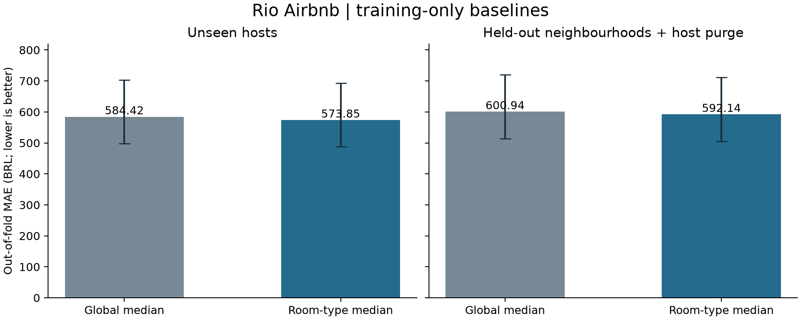

# Baselines and frozen model comparison protocol

[Português](BASELINES.pt-BR.md) · [Study](STUDY.md) · [Home](../README.md)

**Stage 3.3a complete. Two simple baselines evaluated on training folds. Validation and final test are still unused.**

Predicting the median price by room type improves training out-of-fold MAE by BRL 10.57 over a global median (about 1.81%). This is a reference for upcoming ML experiments, not a deployed pricing system or a final-test result.



Error bars: 95% host-cluster bootstrap intervals conditional on fixed out-of-fold predictions. They exclude refitting uncertainty and spatial dependence between different hosts. The paired difference is more precise than either model's absolute error because both models predict the same listings.

## Results

Every eligible training listing (31,636 listings; 17,912 hosts) receives exactly one held-out prediction in each evaluation design. Each median is computed only from that fold's fitting data. An unseen room type falls back to that fold's global median. All priced rows remain eligible, including unusually high asking prices.

| Evaluation | Baseline | MAE BRL | Median absolute error BRL | RMSE BRL | RMSLE | Host-weighted MAE BRL |
|---|---|---:|---:|---:|---:|---:|
| Host CV | Global median | 584.42 | 192.25 | 5,155.29 | 0.8402 | 539.39 |
| Host CV | Room-type median | 573.85 | 181.17 | 5,152.99 | 0.8060 | 532.54 |
| Spatial CV | Global median | 600.94 | 194.00 | 5,161.41 | 0.8931 | 555.42 |
| Spatial CV | Room-type median | 592.14 | 182.00 | 5,159.66 | 0.8636 | 549.62 |

For host CV, the 95% MAE interval is [498.21, 703.53] for the global median and [487.77, 692.77] for the room-type median. The paired room-minus-global MAE difference is -10.57 BRL, with interval [-12.15, -8.84]. Spatial paired difference: -8.79 BRL, interval [-10.18, -7.35]. These intervals resample hosts 1,000 times with seed 42; they are conditional descriptions of these predictions, not guarantees for new populations.

RMSE is much larger than MAE, consistent with the previously observed long price tail. The median absolute error is much smaller than MAE. Reporting only one of these would conceal material variation in errors. No price trimming or retrospective exclusion was used to improve the scores.

## Two evaluation designs

**Host CV:** five deterministic folds, SHA256 of UTF-8 `rio-cv-v1|host_id`, first eight bytes as unsigned big-endian integer modulo five. Hosts never cross fitting/evaluation in a fold. Evaluation folds contain 6,292–6,374 rows. The outer train/validation/test partition is unchanged.

**Spatial CV:** the 160 source neighbourhood names were assigned using SHA256 of `rio-spatial-v1|name`, same byte/modulo rule. The exact mapping is in [protocol.json](baselines/protocol.json), committed as `b430075` before any baseline fit. Only the outer training partition is used. All fitting rows from hosts present in evaluated neighbourhoods are purged, including listings in other neighbourhoods.

| Spatial fold | Fitting rows after purge | Evaluated rows | Fitting rows purged |
|---|---:|---:|---:|
| 0 | 10,218 | 19,320 | 2,098 |
| 1 | 28,210 | 1,420 | 2,006 |
| 2 | 25,378 | 3,189 | 3,069 |
| 3 | 21,012 | 6,808 | 3,816 |
| 4 | 29,805 | 899 | 932 |

Neighbourhoods have unequal listing counts, so folds are very imbalanced. Pooled MAE weights listings and is dominated by larger folds; the per-fold metrics are also published. No fold was reassigned after seeing results. These are groups of held-out neighbourhoods, not contiguous geographic blocks or buffered extrapolation. Nearby areas may remain dependent. Neither design establishes future-time performance.

## Frozen next comparison

The machine-readable protocol specifies six candidates in order: global median, room-type median, Ridge with property features, Ridge with geography, HistGradientBoosting with property features, and HistGradientBoosting with geography. The last four **have not yet been fitted**.

- Ridge: alpha 10, target log1p(price), inverse expm1, predictions floored at zero.
- HistGradientBoosting: absolute-error loss, 200 iterations, 15 leaves, learning rate 0.05, minimum leaf size 20, L2 1, early stopping disabled, seed 42; target in BRL.
- Property features: capacity, bedrooms, beds, bathrooms, minimum nights, room type and property type. Geographic extension: latitude, longitude and neighbourhood.
- Semantic invalid numbers become missing. Numeric imputation/indicators, scaling for Ridge and categorical encoding are fitted inside each training fold. One-hot encoding ignores unseen categories; no IDs or target-derived geographic aggregates enter the models.

Select the lowest **pooled host-CV MAE in BRL** among all six candidates; ties within 1e-9 use the listed candidate order. Spatial CV is diagnostic, not another tuning objective. No expanded search is planned after seeing results. Fit the selected candidate on the outer training partition only, then report validation once without re-ranking. If redesign is necessary, register a new development protocol and leave the final test untouched. Freeze configuration, artifact and validation report before the final evaluation; no train+validation refit in this version.

## Reproduce and audit

Use the environment and source files described in [EDA.md](EDA.md). No additional dependencies were introduced.

```sh
python -m unittest discover -s tests -v
python -m rio.baselines
python -m rio.plot_baselines
```

The runner verifies the frozen training export and writes immutable aggregate metrics and **private individual predictions** to `reports/generated/baselines/`, ignored by Git. Rerunning the same environment/data preserves identical contents; changed outputs require review. The plotting command renders those metrics locally. Publication copies only reviewed aggregates and the plot into `docs/baselines/`.

[Metrics](baselines/metrics.json) include per-fold coverage, pooled scores, uncertainty, versions and hashes for protocol, training data and private prediction artifacts. The 22 synthetic tests cover fold isolation, host purging, unknown-category fallback, listing/host weighting and safeguards inherited from EDA. Raw data and individual predictions are not published.

Source: Inside Airbnb snapshot 2026-06-24, as identified in [source manifest](snapshot.json). These results concern advertised prices of eligible listings, not revenue, occupancy or optimal pricing. The next delivery is 3.3b, implementing the frozen four ML candidates and documenting selection.