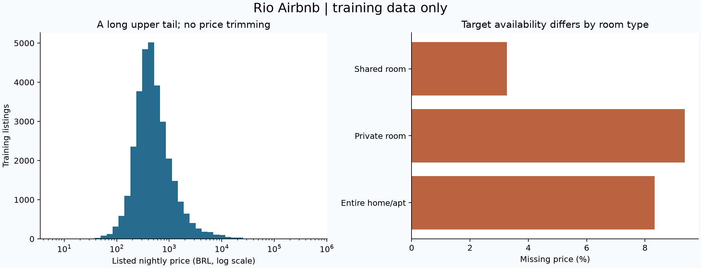
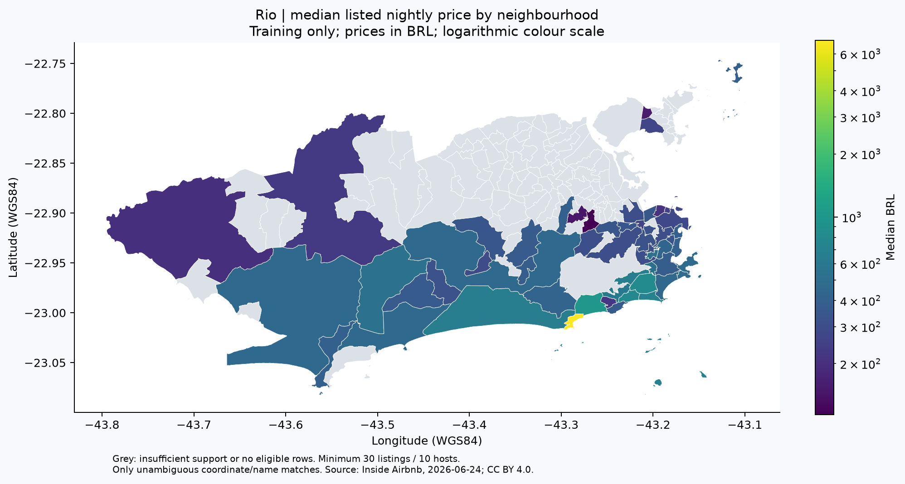

# Exploração do treino: preços, ausências e geografia

[English](EDA.md) · [Protocolo](STUDY.pt-BR.md) · [Início](../README.pt-BR.md)

**Etapa 3.2 concluída. Nenhum modelo foi treinado. O teste final está reservado.**

O treino apresenta preços assimétricos, participação desigual de anfitriões e diferenças relevantes na completude dos dados. Esses achados orientam o próximo experimento; não medem desempenho preditivo nem demonstram por que os preços diferem.

## Partições congeladas

Atribuição de anfitriões pela regra SHA256 declarada antes da EDA. IDs preservados como texto. Não há anfitriões ou anúncios compartilhados entre partições. A elegibilidade supervisionada exige preço finito e positivo; atributos ausentes não removem anúncios elegíveis. Não foi aplicado corte superior de preço.

| Partição | Todos os anúncios | Todos os anfitriões | Anúncios com preço | Anfitriões com preço |
|---|---:|---:|---:|---:|
| Treino | 34.557 | 19.455 | 31.636 | 17.912 |
| Validação | 7.062 | 4.083 | 6.391 | 3.699 |
| Teste final | 7.094 | 4.150 | 6.515 | 3.827 |

Os [metadados](eda/partitions.json) registram hashes e contagens. A atribuição individual permanece local. A preparação verifica presença/validade do alvo para elegibilidade, mas não produz estatísticas de preços ou exportações com alvos da validação/teste. A EDA lê apenas o treino conferido por hash e as geometrias, rejeitando anfitriões de outras partições ou arquivos alterados.

## O que observamos no treino

Nos 31.636 anúncios com preço, a mediana é **R$ 454,97**, a média **R$ 875,69** e a metade central está entre **R$ 297 e R$ 756**. O percentil 99 é R$ 7.411,14. São preços pedidos na coleta, não transações. Não houve corte de valores extremos: preços muito altos continuam sendo anúncios não verificados, sem validação como preços de mercado realizados.



Os rótulos e a notação decimal das tabelas abaixo seguem os arquivos públicos em inglês: vírgula separa milhares, ponto separa decimais.

| Tipo de acomodação | Anúncios com preço | Mediana BRL | Preço ausente entre todos os anúncios do tipo |
|---|---:|---:|---:|
| Entire home/apt | 25,673 | 490.71 | 8.32% |
| Private room | 5,495 | 297.00 | 9.37% |
| Shared room | 444 | 119.00 | 3.27% |

Um grupo de acomodação foi suprimido por suporte insuficiente. Cada grupo publicado exige ao menos 30 anúncios com preço e 10 anfitriões distintos. As estatísticas dão peso a anúncios: o maior 1% dos anfitriões elegíveis de treino (180, arredondando para cima) concentra **16,97%** dos anúncios com preço. Isso justifica reportar erros ponderados tanto por anúncio quanto por anfitrião na próxima etapa.

## Ausências e seleção

2.921 de 34.557 anúncios do treino (**8,45%**) não têm alvo utilizável. A completude dos atributos difere bastante:

| Atributo | Ausente nos anúncios com preço | Ausente nos anúncios sem preço |
|---|---:|---:|
| bedrooms | 14.77% | 15.41% |
| beds | 3.76% | 87.74% |
| bathrooms | 8.28% | 88.67% |

Isso demonstra perfis observados diferentes, sem diagnosticar formalmente o mecanismo das ausências. Excluir anúncios sem alvo altera a população representada. Efeitos da coleta/disponibilidade são hipóteses a investigar; não podemos inferir os preços ausentes nem garantir desempenho nesses casos. Preservar indicadores de ausência e ajustar imputação dentro dos folds de treino. Quartos/camas devem ser inteiros não negativos; banheiros, números finitos não negativos; capacidade/noites mínimas, inteiros positivos. Valores inválidos serão tratados como ausentes no pré-processamento futuro; nenhum valor preenchido do treino violou essas regras.

## Geografia e cobertura

A fonte contém 160 MultiPolygons não vazios. Sem membro explícito de CRS, a interpretação é WGS84, longitude/latitude, conforme [GeoJSON RFC 7946](https://www.rfc-editor.org/rfc/rfc7946); as coordenadas dos anúncios seguem o dicionário da fonte. Coordenadas e limites dos polígonos passaram nas verificações de faixa geográfica. Isso verifica consistência, sem validar a precisão dos limites por levantamento independente.

Caju tinha uma autointerseção em um anel. [Shapely make_valid](https://shapely.readthedocs.io/en/stable/reference/shapely.make_valid.html), método linework, gerou MultiPolygon válido, com variação relativa de área planar de 1,27e-15. O dado bruto permanece intacto. Correções que produzam outros tipos de geometria ou mudança relativa acima de 1e-8 são interrompidas para revisão. A razão em graus serve somente ao diagnóstico, não representa área territorial.

O predicado [covers](https://shapely.readthedocs.io/en/stable/reference/shapely.covers.html) inclui fronteiras. Pontos em múltiplos polígonos, fora de todos ou inconsistentes com o nome do bairro recebem sinalizações separadas. Os **34.557 pontos de treino** coincidem com um único polígono e o bairro informado, sem ambiguidades. Isso não comprova endereços exatos: as coordenadas são aproximadas e a própria fonte deriva os bairros dessas coordenadas.



O mapa mostra **53 bairros**, cobrindo **30.727 anúncios com preço (97.13% do treino com preço)**. Os outros 107 polígonos ficam cinza por suporte insuficiente ou ausência de anúncios elegíveis no treino. Cinza não significa preço zero ou ausência de aluguel por temporada. Os 909 anúncios com preço fora dos grupos publicáveis continuam na população de modelagem. As medianas misturam tipos e tamanhos de imóveis; o mapa não isola efeito causal do bairro.

Os seis bairros com mais anúncios com preço no treino são apresentados como referência, sem ranking de preços:

| Bairro | Anúncios de treino com preço | Mediana BRL |
|---|---:|---:|
| Copacabana | 9,938 | 452.67 |
| Ipanema | 2,584 | 696.23 |
| Barra da Tijuca | 2,393 | 640.00 |
| Centro | 2,137 | 278.00 |
| Recreio dos Bandeirantes | 1,603 | 457.00 |
| Botafogo | 1,328 | 384.33 |

## Reprodução

Utilizado Python 3.11.14. Criar ambiente isolado e instalar `requirements-eda-lock.txt`; o `requirements.txt` antigo pertence ao fluxo acadêmico.

```sh
python -m venv .venv
# Ative .venv conforme seu shell e execute:
python -m pip install -r requirements-eda-lock.txt
python -m unittest discover -s tests -v
python -m rio.prepare
python -m rio.eda
```

Obter uma única vez os dois arquivos exatos de [snapshot.json](snapshot.json), conforme README. A preparação grava arquivos imutáveis em `data/processed/rio-v1/`; conteúdo idêntico é preservado na reexecução, conteúdo diferente é recusado. Os metadados versionados fixam o hash do treino. A EDA grava em `reports/generated/eda/`; a publicação de agregados selecionados é uma etapa separada de revisão. Dados brutos, atribuições e linhas individuais estão ignorados no Git. Testes usam dados fictícios, sem downloads da fonte.

Os [resultados estruturados](eda/summary.json) registram versões, ausências, suporte e verificações geográficas. Todos os gráficos e resumos derivam somente do treino. Fonte: [Inside Airbnb](https://insideairbnb.com/get-the-data/), snapshot 24/06/2026, CC BY 4.0; consultar [premissas](https://insideairbnb.com/data-assumptions/). Datas indisponíveis não confirmam reservas; preços anunciados não demonstram receita.

## Consequências para 3.3

Comparar baselines previstos e um conjunto pequeno de modelos previamente fixado; medir contribuição da geografia frente a atributos do imóvel. Transformações aprendidas ficam dentro dos folds de treino por anfitrião. Congelar folds espaciais e remover anfitriões compartilhados antes da avaliação secundária. Investigar concentração dos erros e ausências, escolhendo apenas com desenvolvimento. Avaliar o teste final somente após congelar a decisão completa. A EDA não sustenta previsão temporal, causalidade ou uso validado em produção.
