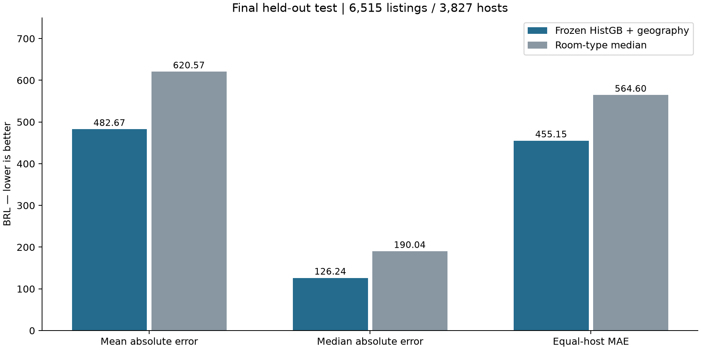

# Final held-out evaluation

[Português](FINAL.pt-BR.md) · [Selection](SELECTION.md) · [Home](../README.md)

**Stage 3.3c complete. The final test has been consumed once. The model is unchanged and must not be tuned using these results.**

On **6,515 eligible listings from 3,827 unseen hosts**, the frozen HistGradientBoosting model with geography achieved **MAE BRL 482.67**, versus **BRL 620.57** for training-derived room-type medians: **22.22% lower MAE**. This estimates same-snapshot performance on listings with observed positive asking prices; it is not a future-price forecast or a production result.



| Metric | Frozen model | Room-type median |
|---|---:|---:|
| MAE BRL | 482.67 | 620.57 |
| Median absolute error BRL | 126.24 | 190.04 |
| RMSE BRL | 3036.63 | 3292.67 |
| RMSLE | 0.61 | 0.84 |
| Equal-host MAE BRL | 455.15 | 564.60 |

RMSLE with additional precision: 0.611815 versus 0.839881. The median error (BRL 126.24) is much smaller than mean error; RMSE is BRL 3,036.63. Large errors therefore remain material. No high-price trimming or retrospective exclusion was applied.

## Uncertainty and comparison

Selected-model MAE 95% host-cluster bootstrap interval: **[366.38, 632.28] BRL**. Paired model-minus-baseline difference: **-137.90 BRL**, interval **[-190.99, -97.01]**. Intervals use 1,000 host resamples with seed 42 and fixed predictions. They account for multiple listings per host but exclude model-refitting uncertainty and dependence between different hosts, including spatial dependence.

Validation MAE was BRL 434.08; final-test MAE is BRL 482.67. These are different held-out samples, not a chronological trend. Final-test results were not used to change candidate choice, parameters, preprocessing or output flooring. The artifact remains trained solely on the original 31,636 training listings.

## Eligibility and error variation

Of 7,094 assigned test listings, 6,515 have finite positive prices; **579 lack an eligible target**. They were excluded under the predeclared rule, not imputed. Thus supervised coverage is approximately 91.84% of assigned test listings; missing-price populations are outside the evaluated target population. Predictor missingness is handled by the frozen pipeline.

| Room type | Listings | Hosts | MAE BRL | RMSLE |
|---|---:|---:|---:|---:|
| Entire home/apt | 5341 | 3244 | 501.22 | 0.587 |
| Private room | 1117 | 735 | 413.42 | 0.715 |
| Shared room | 57 | 32 | 101.80 | 0.717 |

All three observed room-type groups pass the minimum support rule. Another **85 observed neighbourhood groups** are suppressed because they have fewer than 30 eligible listings or 10 hosts. Complete supported aggregates are in [metrics.json](final/metrics.json).

Itanhangá has MAE BRL 6,430.31 over 32 listings/22 hosts but median absolute error BRL 238.99: its average error is strongly affected by the tail. São Conrado has MAE BRL 1,726.00 over 87 listings/72 hosts. These small-to-moderate groups need cautious interpretation, mix property types/sizes, and do not establish causal neighbourhood effects. They will not trigger post-test tuning. No individual property or host is identified in the report.

## Integrity and one-time execution

The [final protocol](final/PROTOCOL.md) and evaluator were committed as `000022a` before test access. Preflight verified source, assignments, training data, model, code, dependency lock and decision hashes; all installed dependency pins and Python version; actual estimator class, hyperparameters, feature list and fitted iteration count. The model SHA256 remains `a68512f4942bf396ccd0452496edd409334827043416927272d42512161d3a32`.

An exclusive marker was written before reading test prices. The loader filters to test hosts before parsing targets and checks exact listing/host membership and no overlap with train/validation. The evaluator calls predict on the selected pipeline, never fit. The reference uses only training medians, with global fallback for unseen room types. Individual predictions were saved privately before computing summaries.

The test is now **CONSUMED**. Do not delete its marker or rerun selection/training to improve these results. The final CSV is ignored by Git and has SHA256 `d0da23892b7dbd71c46a8b4c29f440342bba2f7c1cacb06124fccbadf0051f81`. Public JSON includes aggregate metrics and provenance only.

## Verification and reproduction boundaries

Use the existing Python 3.11.14 environment and `requirements-model-lock.txt`. Thirty-six synthetic tests passed, including wrong-hash rejection, altered estimator parameters, holdout overlap, target-access filtering and prevention of repeated test runs.

```sh
python -m unittest discover -s tests -v
python -m rio.final_evaluation --check-only
# Rebuild summaries/plot from saved private predictions; no new prediction run:
python -m rio.final_evaluation --summarize-saved
python -m rio.plot_final
```

The default `python -m rio.final_evaluation` command is single-use and now refuses execution in this workspace. Summary rebuilding verifies hashes and preserves immutable output. A fresh reproduction with the same data does not create a new independent test. Model bytes and individual data are not distributed; see [selection](SELECTION.md) for artifact provenance.

Limitations remain: one historical snapshot, approximate coordinates, incomplete predictors, observed differences in completeness associated with missing prices, unequal host representation, and advertised rather than transaction prices. The analysis supports neither revenue/occupancy claims, optimal pricing nor a deployment recommendation. Next: inference examples and a clean-checkout demonstration using the same frozen artifact, without further selection.
