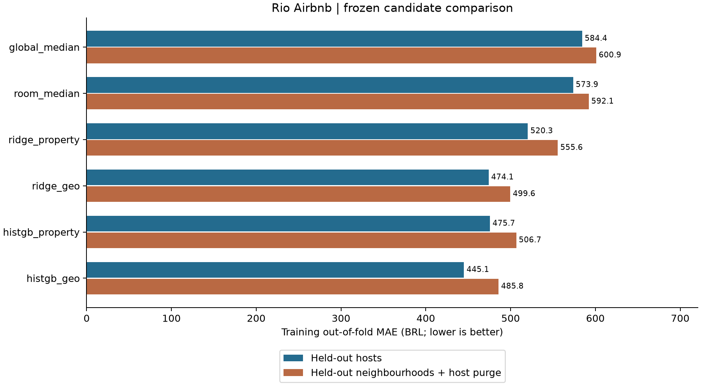

Atualização 17/09/2026: [avaliação final concluída](FINAL.pt-BR.md); teste final consumido. Referências abaixo ao teste reservado descrevem o estágio anterior de desenvolvimento.

# Seleção de modelo e validação externa

[English](SELECTION.md) · [Protocolo](baselines/protocol.json) · [Início](../README.pt-BR.md)

**Etapa 3.3b concluída. HistGradientBoosting com geografia selecionado pelo MAE nos folds de treino por anfitrião. Validação externa avaliada uma vez. Teste final permanece intacto.**

MAE fora da amostra de treino: **R$ 445,07**, frente a R$ 573,85 da mediana por tipo, redução de 22,44%. Adicionar geografia ao modelo de árvores reduziu o MAE de 475,70 para 445,07 (6,44%). São comparações de desenvolvimento, não resultados do teste final ou evidência causal.



A tabela usa ponto decimal, conforme os arquivos estruturados.

| Candidato | MAE por anfitrião BRL | MAE espacial BRL |
|---|---:|---:|
| global_median | 584.42 | 600.94 |
| room_median | 573.85 | 592.14 |
| ridge_property | 520.35 | 555.61 |
| ridge_geo | 474.12 | 499.62 |
| histgb_property | 475.70 | 506.66 |
| histgb_geo | 445.07 | 485.78 |

Os 31.636 anúncios elegíveis do treino recebem uma previsão fora da amostra por desenho/candidato. Baselines foram reutilizados. Cinco folds separam anfitriões entre ajuste e avaliação; cinco folds espaciais também separam bairros e removem anfitriões compartilhados. Folds espaciais são desbalanceados, não contíguos e sem faixa de distância; áreas vizinhas podem permanecer dependentes. Ver [metodologia](BASELINES.pt-BR.md).

O vencedor tem MAE espacial de 485,78, pior que no desenho por anfitrião. A geografia ajuda esses candidatos predefinidos, sem comprovar generalização para outras regiões ou datas futuras. Escolher o menor de seis erros de CV também torna essa estimativa otimista como resultado final.

## Pipeline congelado e correção registrada

Configuração: perda de erro absoluto, 200 iterações, 15 folhas, taxa 0,05, mínimo de 20 casos por folha, L2 1, sem parada antecipada, semente 42. Regras numéricas, imputação mediana e indicadores de ausência de todos os campos operam dentro dos folds de ajuste. Categorias usam one-hot que ignora desconhecidas. IDs e agregados derivados do alvo são excluídos. Ridge também padroniza números e ajusta log1p(preço).

A primeira tentativa parou em uma previsão negativa do HistGB sem geografia, fold por anfitrião 1. A tentativa está preservada localmente. A saída passou a ter piso zero, como já previsto para Ridge. A comparação inteira foi refeita com novo hash de código, mantendo folds, hiperparâmetros e seleção. É uma alteração de implementação após falha, explicitamente registrada, não uma regra original do HistGB. Nenhum conjunto externo tinha sido utilizado. Ver [registro de implementação](selection/IMPLEMENTATION.md).

O vencedor foi ajustado somente nos **31.636 anúncios de treino**, serializado e identificado por hash **antes de abrir a validação externa**. Não houve refit treino+validação, reordenação ou nova busca. O [manifesto do artefato](selection/selected_artifact.json) vincula modelo, decisão, código e dependências. O binário permanece privado.

## Validação externa: 6.391 anúncios / 3.699 anfitriões

| Métrica | Selecionado | Mediana por tipo |
|---|---:|---:|
| MAE R$ | 434,08 | 548,00 |
| Mediana do erro absoluto R$ | 123,55 | 181,71 |
| RMSE R$ | 2.251,50 | 2.460,72 |
| RMSLE | 0,6124 | 0,8035 |
| MAE por anfitrião R$ | 418,33 | 522,33 |

Redução de MAE: **20,79%**. Intervalo de 95% do MAE por bootstrap de anfitriões: [365,91; 506,29]. Diferença pareada selecionado menos baseline: -113,93, intervalo [-144,25; -89,53]. São 1.000 reamostragens, semente 42, previsões fixas; não incluem incerteza de refit ou dependência entre anfitriões. RMSE diferente entre CV e validação reflete amostras distintas, não melhora temporal.

## Variação dos erros e limites

A tabela usa ponto decimal.

| Acomodação | Anúncios | Anfitriões | MAE BRL | RMSLE |
|---|---:|---:|---:|---:|
| Entire home/apt | 5127 | 3094 | 457.39 | 0.565 |
| Private room | 1180 | 738 | 343.48 | 0.752 |
| Shared room | 83 | 34 | 285.93 | 1.041 |

Quartos compartilhados têm maior erro relativo/log; seu MAE por anfitrião é R$ 477,44. Joá apresenta MAE de R$ 3.202,45 em 30 anúncios/16 anfitriões; São Conrado, R$ 1.810,68 em 104 anúncios/72 anfitriões. Mesmo com suporte mínimo, há incerteza e mistura de tipos/tamanhos. São diagnósticos, não efeitos causais ou justificativa para nova rodada de ajustes.

Os [agregados da validação](selection/validation.json) suprimem grupos com menos de 30 anúncios elegíveis ou 10 anfitriões: um tipo de acomodação e 90 grupos de bairros. Preços ausentes e atributos incompletos limitam representatividade, conforme [EDA](EDA.pt-BR.md). Preço anunciado não é transação, receita ou preço ótimo. A cauda superior de preços foi mantida sem cortes.

## Reprodução e limites operacionais

Usar Python 3.11 e `requirements-model-lock.txt`, que mantém pins da EDA e adiciona scikit-learn 1.9.1 e dependências. Testes usam dados sintéticos; experimentos exigem fontes/treino exatos da preparação anterior.

```sh
python -m pip install -r requirements-model-lock.txt
python -m unittest discover -s tests -v
# Somente reprodução nova, após preparar fontes e treino congelados:
python -m rio.selection
python -m rio.validate_selection
python -m rio.plot_selection
```

Os comandos recusam saídas existentes ou validação já iniciada. Neste workspace, consultar resultados salvos sem repetir treino/validação. O carregador filtra anfitriões antes de interpretar preços e confere os membros com as atribuições congeladas. Esta entrega não contém carregador de teste final.

Trinta testes sintéticos passaram, incluindo pré-processamento dentro do fold, categorias desconhecidas, novas ausências, piso zero, desempates e descarte de linhas fora da validação antes de acessar alvos. Os [detalhes da comparação](selection/comparison.json) registram métricas por fold, incerteza e proveniência. Previsões individuais, fontes, modelo e tentativa interrompida permanecem ignorados localmente; somente agregados e gráfico são publicados.

Próxima etapa: 3.3c, conferir o artefato congelado e avaliar o teste final uma vez, sem refit. Relatar métricas finais e limitações separadamente do desenvolvimento.
